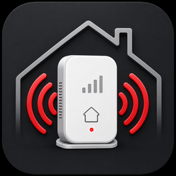

# Verizon LTE Extender

A Home Assistant custom integration for the Askey / Verizon 4G LTE Network
Extender, model 4116G.

The integration logs in to the extender's local web API, manages its XSRF and
authentication cookies automatically, and polls device status without requiring
cookies copied from a browser.

## Features

- Config-flow setup and editable connection options
- Automatic login and session refresh
- Local polling through `/webapi/simStatus`
- Product details from `/webapi/info`
- Status, connectivity, GPS, user-count, network, and diagnostic entities
- Sensitive identifiers disabled by default
- No latitude or longitude entities

## Installation

### HACS

1. Open HACS.
2. Select **Integrations**.
3. Add `https://github.com/bditter/ha-verizon-lte-extender` as a custom
   repository with category **Integration**.
4. Install **Verizon LTE Extender**.
5. Restart Home Assistant.

### Manual

Copy `custom_components/verizon_lte_extender` into the `custom_components`
directory in your Home Assistant configuration, then restart Home Assistant.

## Configuration

In Home Assistant, open **Settings > Devices & services > Add integration** and
search for **Verizon LTE Extender**.

Configure:

- **Host or base URL**: The full extender URL, such as
  `https://192.168.1.20`
- **Admin password**: The local extender web-interface password
- **Verify SSL certificate**: Disabled by default for self-signed certificates
- **Scan interval**: 60 seconds by default, with a minimum of 15 seconds

These settings can be changed later from the integration's **Configure** menu.

## Authentication

Firmware `v3.6.0408` hashes the admin password with SHA-256 and sends it with an
expiration timestamp to `/webapi/login`. A successful response sets
`wfx_unq`, `X-XSRF-TOKEN`, and `Authtoken` cookies. Subsequent requests send the
XSRF cookie value in the `X-XSRF-TOKEN` header.

When the API reports an expired or invalid session, the integration logs in
again and retries the request once. Passwords and session tokens are never
written to logs.

## Entities

The integration provides:

- GPS status
- Active users and total active users
- Operation mode and uptime
- Backhaul IPv4 and IPv6 addresses
- Software version
- Cell type, 4G signal, and GPS signal
- IP mode and IPsec IP
- PA temperature when reported
- Online, GPS acquired, and in-service binary sensors

HNB name, CSG ID, serial number, and MAC address are diagnostic entities that
are disabled by default. Latitude and longitude are not exposed.

## Supported Device

- Manufacturer: Askey
- Product: Verizon 4G LTE Network Extender
- Model: 4116G

Other Askey firmware using the same web API may work but has not been verified.

## License

MIT
